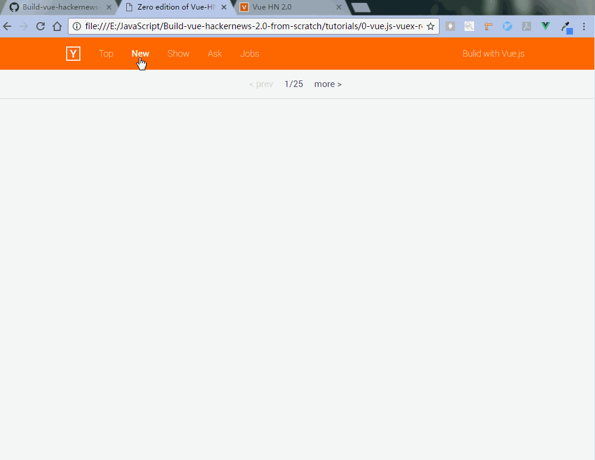
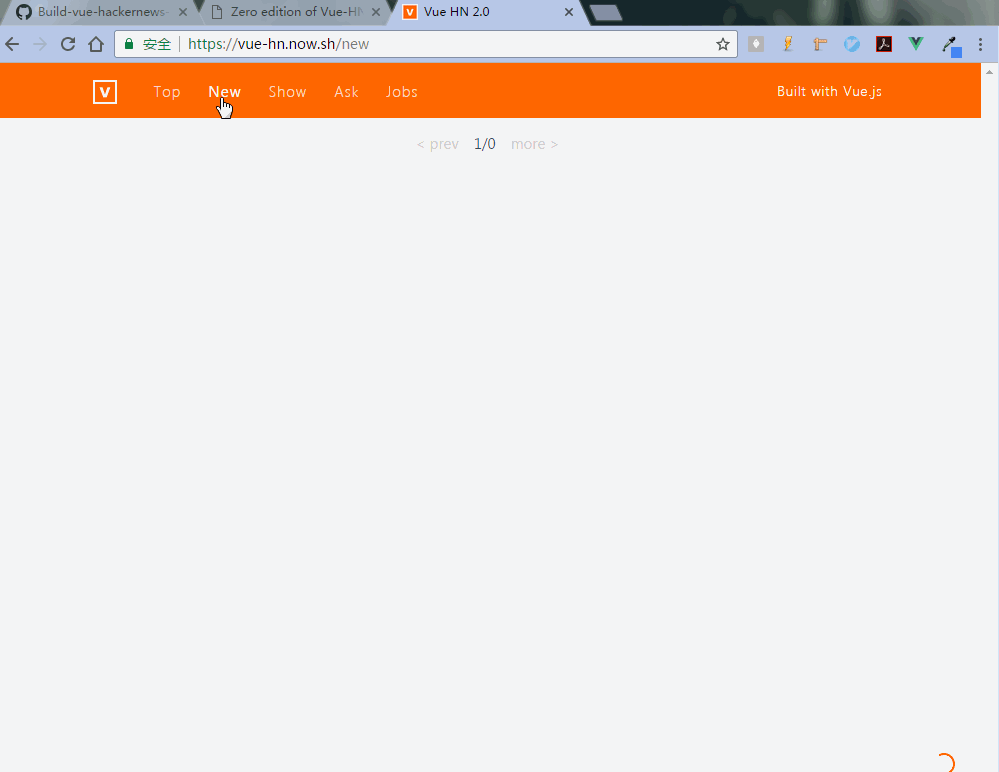

# Bulid vue-hackernews-2.0 from Scratch

## Preface [ 中文版本 ](./README.cn.md)

Welcome to my first application bulid tutorial: **Bulid vue-hackernews-2.0 from Scratch**.

As a new learner of front-end development and Vue.js, I find it a bit difficult to understand the offical example: vue-hackernews-2.0. Meanwhile, the complexity of this example really attracts me. So I spend some time on figuring out how it works and with this tutorial I will show you how I rebulid it step-by-step.

**Note that this tutorial is for beginners.** I will divide this tutorial into serval chapters, each of then represent different step of the whole process. In the head of every chapter, I would list some basic understandings that are acquired for the corresponding chapter.

> Notices: Vue-HN is short for vue-hackernews-2.0 in all the after chapters to help us save some keystrokes. The code of this tutorial works on Windows 7, other OS haven't been tested.

## Brief Intro to Each Edition
### 0. Vue.js, Vuex, Vue-router, HN API, Firebase, ES6
As a new learner of front-end development, ever since I started to learn Vue-HN project, I wondered whether it is possible to make this project with just Vue.js, Vuex and Vue-router. After some tries and failures, I finally made it. The GIFs below are the animation screenshots of the my edition and offical edition respectively.

    
     
    [ My Edition ]
     
     
    
     
    [ Offical Edition ]

### 1. Webpack, Vue.js, Vue-router, Vuex and Hackernews API
In this chapter, we will bulid another edition of Vue-HN in which we would start to make this project more modularized and maintainable. With some very basic configurations of webpack, we would make this edition of the project work. In order to bulid the whole project step by step, we still did not consider server, SSR(server-side-render), cache and so on in this edition.
So, the following animation screenshot would show us the basic functions in this edition and some simple deconstruction of the project.

    
     
    [Basic Functions and Simple Deconstruction]

### 2. Server, Packages and Plugins for Better Performance
This edition can be the most difficult part for me in the whole project.
So many plugins, packages and new techniques make the project extremely complex for me. I have tried my best to figure this out and in the following part I will share what I have got with you.

### 3. Change the Project as I like
In this edition, I will change the style of Vue-HN to be more Vue.js, at least in the visual respect. The GIF below is the final editon of mine, you can have a visit to the original website: [Vue-HackerNews 2.0](https://vue-hn.now.sh/top). The details of the differences will be discussed in Process part.

    
     
    [Last Edition of Vue-HackerNews]

## Table of Contents

[0-vue.js-vuex-router-firebase-ES6](/tutorials/0-vue.js-vuex-router)  
[1-webpack-vue.js-router-store-firebase](/tutorials/1-webpack-vue.js-router-store-firebase)    
[2-Packages-Plugins-for-Better-User-Experience](/tutorials/2-Packages-Plugins-for-Better-User-Experience)  
[3-Change-the-Project-as-I-like](/tutorials/3-Change-the-Project-as-I-like)

## License
Copyright (c) 2017 Copyright Holder All Rights Reserved.  
MIT (http://opensource.org/licenses/mit-license.php)
