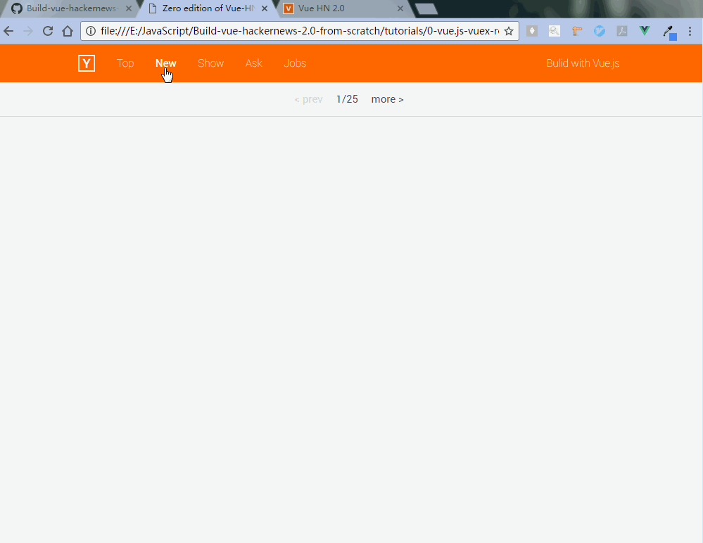

# 0. Vue.js, Vuex, Vue-router, HN API, Firebase, ES6

## 前言 [ English Version ](./README.md)

作为一个前端初学者，我对最原始的页面构造比较熟悉，也就是页面只由 HTML、CSS 以及 JavaScript 构成。所以自从我开始学习 Vue-HN 这个项目我就想是不是可以用最原始的方法来实现这个项目（当然，不考虑用户体验及性能等方面）。在经过多次失败的尝试之后，我终于只利用 Vue.js 及其生态中的一些库实现了这个版本。下面这两个动图就分别是我这个版本和官方版本。

<p align="center">
    
    <br/>
    [ 我的版本 ]
    <br/>
    <br/>
    
    <br/>
    [ 官方版本 ]
</p>

从上面的动图我们可以清楚的看到，基本上官方给出例子中的所有功能在我这个版本中都被实现出来了，而且仅仅只依赖于 Vue.js 以及其生态中的一些库。在开始搭建这个版本的项目之前，你应该对下面所列的链接中的知识点有所了解。了解完之后开始看代码才会有初步的认识。（了解每个链接对应的知识点即可，链接仅供参考。比如要了解 ES2015 的知识，就很推荐阮一峰老师的教程）

- [Vue.js 2.0: The Progressive JavaScript Framework](https://vuejs.org/)
- [Vue-router 2.0: A Simple Router for Vue.js](https://router.vuejs.org/en/)
- [Vuex 2.0: State Management Patter and Library for Vue.js Application ](http://vuex.vuejs.org/en/)
- [Hacker News API: HackerNews API Works with Firebase](https://github.com/HackerNews/API)
- [Learn ES2015: A detailed overview of ECMAScript 2015 features](https://babeljs.io/learn-es2015/)
- [Firebase: App success made simple](https://firebase.google.com/docs/web/setup)

一眨眼看到需要了解这么多资料，你可能会被吓到。其实你不用担心，因为列出来的这些链接中除了 Vue.js 及其生态需要花较多时间来深入了解之外，其与的只需要稍微了解就行。比如 ES6 的内容，你暂时只需要了解箭头函数、 Promise 异步操作、扩展运算符等一些基本知识。另外两个链接则是 API，在用到的时候稍微花一点点时间浏览官方文档就行。

## 过程

搭建这个版本的时候，有几个关键的技术难点需要解决：
- 怎样在不安装 Firebase 包的情况下通过 HackerNews 提供的 API 获取所需要的数据？    
**Answer :** 通过阅读 Firebase 的官方文档，我发现可以通过在文件中通过连接引入的方式来获取 Firebase 包的内容。除此之外，本地只需要针对项目稍加配置就行。下面是通过与不通过安装包的两种本地配置代码：
    ```javascript
    // without installing firebase package:

    var config = {
        databaseURL: "https://hacker-news.firebaseio.com"
    };
    firebase.initializeApp(config);

    var api = firebase.database().ref('/v0');

    // with firebase package:
    import Firebase from 'firebase'

    const api = inBrowser
      ? new Firebase('https://hacker-news.firebaseio.com/v0')
      : (process.__API__ || (process.__API__ = createServerSideAPI()))

    function createServerSideAPI () {
      const api = new Firebase('https://hacker-news.firebaseio.com/v0')

    ```

- 怎么实现 vuex 和 router 之间的通讯？  
**Answer :** 保证通讯需要注意以下两点:
    - 在同一个 Vue 实例里面注册这两个插件;
    - 通过一个叫做 "vuex-router-sync" 的插件实现通讯.  
    > 注意: 因为我们这个版本中并没有引入包管理工具，所以我们需要手动将这个插件包的 index.js 文件中的代码提取出来，稍作更改后通过链接的形式引入到主页面*    

- 怎么转换各个单文件组件（也就是 .vue 文件）？   
**Answer :** 每个单文件组件都包含三个部分： HTML 模板， JavaScript 脚本以及 CSS 样式。模板部分我们通过 “x-template” 来替换， JavaScript 脚本我们通过 “Vue.extend” 来替换， CSS 样式则直接写在样式表中就可以了。如果你想知道详细的信息，那就需要下载源码来瞧瞧了。

在攻克这些难点，又加上对于 Vue.js 及其生态有较深入的了解之后，你应该也能自己完成这个版本的项目搭建过程了！（虽然不能用于生产，没有什么实际意义，但是实现的过程我认为还是很有意思的。）

> 注意：因为文件之间的依赖原因，所以浏览器对于主页面文件头中的链接加载顺序直接影响到这个版本的成败。经测试，在 Firefox 和 IE 中都会优先加载本地文件然后加载外链，这并不是我所希望的顺序，所以在这两个浏览器中测试失败（可以通过将本地文件上传云存储，然后替换成外链解决）。在 Chrome 中测试成功。


## 运行设置

```bash
# clone the project to your computer
git clone https://github.com/Detachment/Build-vue-hackernews-2.0-from-scratch.git

# open index.html file in Chrome.
```


## 后续

目前一切顺利。但是如果我们更耐心些，重新审视这个版本的项目，我们会发现存在一些致命的缺陷。比如所有的文件都很混乱，项目的结构非常的脆弱，而且没有任何措施用于提高访问速度、优化用户体验。这些都会造成很高的维护成本。  
在下一个版本中，我们将针对这些作出一些改进。  

下一版本：   
[1-webpack-vue.js-router-store-firebase](/tutorials/1-webpack-vue.js-router-store-firebase/README.cn.md)    


目录：  
[Introductioin](/README.cn.md)  
[0-vue.js-vuex-router-firebase-ES6](/tutorials/0-vue.js-vuex-router/README.cn.md)   
[1-webpack-vue.js-router-store-firebase](/tutorials/1-webpack-vue.js-router-store-firebase/README.cn.md)    
[2-Packages-Plugins-for-Better-User-Experience](/tutorials/2-Packages-Plugins-for-Better-User-Experience/README.cn.md)  
[3-Change-the-Project-as-I-like](/tutorials/3-Change-the-Project-as-I-like/README.cn.md)
